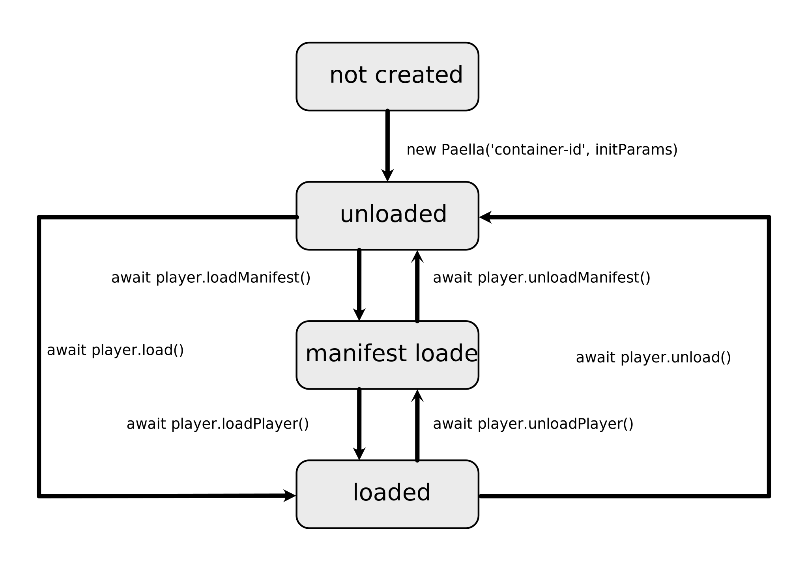

# Paella Player life cycle

Once we create the Paella Player instance, it can be in three load states:

- Unloaded: The Paella Player instance is created. In this state all static parameters of the player are defined (configuration, available plugins, etc.).
- Manifest loaded: In this state the configuration, dictionaries, video manifest and some types of early loading plugins (data, keyboard shortcuts, event tracking and the like) have been loaded.
- Loaded: In this state, the video streams, the video layout plugins, the user interface and the rest of the plugins are loaded.

## Switch player state

There are different cases in which it is useful to switch between these states, for example, in SPA applications where we want to reload a different video, or in long lists of videos where we want to download some of them to free resources.

They are several APIs with which we can move between theese states:



Note: check Paella Player initialization [here](initialization.md).

```javascript
import { Paella, PlayerState, PlayerStateNames } from 'paella-core';

...

const player = new Paella('container-id', initData);

console.log(PlayerStateNames[player.state]);    // UNLOADED

await player.loadManifest();
console.log(PlayerStateNames[player.state]);    // MANIFEST

await player.loadPlayer();
console.log(PlayerStateNames[player.state]);    // LOADED

await player.unloadPlayer();
console.log(PlayerStateNames[player.state]);    // MANIFEST

await player.unloadManifest();
console.log(PlayerStateNames[player.state]);    // UNLOADED

// Load and unload paella player in one step
await player.load();
console.log(PlayerStateNames[player.state]);    // Loaded

await player.unload();
console.log(PlayerStateNames[player.state]);    // Unloaded

// Reload paella player
await player.reload();
```

If you are using Paella Player in a SPA application, you can use the `reload()` function to unload the player, do some action and reload it again. You can specify the action as a parameter using a function that can be asynchronous if you need it:

```javascript
await player.reload(() => {
  // This code is executed fater unload the player,
  // and before loading it again
  localtion.hash = 'id=other-video-id';
})
```

Note: see [paelle player react](paella_react.md) or [paella player svelte](paella_svelte.md) for more information about using Paella Player in SPA applications.

In addition, the `reload()` function can be used while Paella Player is in any loading state. If state is `UNLOADED`, the `reload()` function works in the same way as `load()`. In other cases, the player will be partialy or fully unloaded, depending on the state.

## Life cycle exceptions

There are certain functions that can only be called in a specific state. Other functions modify their behavior depending on the player state:

<table>
  <tr>
    <th>Function</th>
    <th>Required state</th> 
  </tr>
  <tr>
    <td>`load()`</td>
    <td>Any</td> 
  </tr>
  <tr>
    <td>`unload()`</td>
    <td>Any</td> 
  </tr>
  <tr>
    <td>`reload()`</td>
    <td>Any</td> 
  </tr>
  <tr>
    <td>`loadManifest()`</td>
    <td>`PlayerState.UNLOADED`</td> 
  </tr>
  <tr>
    <td>`loadPlayer()`</td>
    <td>`PlayerState.MANIFEST`</td> 
  </tr>
  <tr>
    <td>`unloadManifest()`</td>
    <td>`PlayerState.MANIFEST`</td> 
  </tr>
  <tr>
    <td>`unloadPlayer()`</td>
    <td>`PlayerState.LOADED`</td> 
  </tr>
</table>

If any of these functions are used in an unsuitable state, Paella Player will throw an exception.

## Life cycle and events

It is important to note that when the player is downloaded, the registered event handlers will be deleted if we do not indicate otherwise. See all the information about [event handlers in this document](events.md).

## Transitional states

The change from one state to another in the lifecycle is usually not instantaneous. For example, depending on the bandwidth of the connection, moving from the `MANIFEST` state to the `LOADED` state may take a few seconds. There are four extra states that are generated during these transitions:

<table>
  <tr>
    <th>Source state</th>
    <th>Destination state</th>
    <th>Transitional state</th> 
  </tr>
  <tr>
    <td>`PlayerState.UNLOADED`</td>
    <td>`PlayerState.MANIFEST`</td>
    <td>`PlayerState.LOADING_MANIFEST`</td>
  </tr>
  <tr>
    <td>`PlayerState.MANIFEST`</td>
    <td>`PlayerState.LOADED`</td>
    <td>`PlayerState.LOADING_PLAYER`</td>
  </tr>
    <tr>
    <td>`PlayerState.LOADED`</td>
    <td>`PlayerState.MANIFEST`</td>
    <td>`PlayerState.UNLOADING_PLAYER`</td>
  </tr>
    <tr>
    <td>`PlayerState.MANIFEST`</td>
    <td>`PlayerState.UNLOADED`</td>
    <td>`PlayerState.UNLOADING_MANIFEST`</td>
  </tr>
</table>

## Error state

If an error occurs while loading a video, the player will remain in an 'ERROR' state. This state is only used to indicate that an error has occurred. Otherwise, the internal state of the player remains the same as in the `UNLOADED` state.

From the `ERROR` state it is possible to restart the loading of a video. If the error in the video upload has been solved (for example, if we change the video identifier to be uploaded), the upload can be performed correctly.

It is important to note that, once an error has occurred, the `unload()` function must first be called to reload the player.
