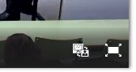
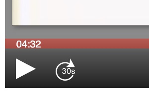

# Start using Paella for developers

Starting with version 7, Paella Player is divided into several packages:

- `paella-core`: is the base library from which we can create our own custom player.
- `paella-*-plugin`: a series of packages that include different plugins to extend Paella.
- `paella-player`: is the main package of Paella Player, which integrates `paella-core` with other plugins. Unlike the other packages, `paella-player` is not a library. 

In this tutorial, you are going to create your own Paella Player configuration from scratch. You will set up an installation with the dependencies you need, which will usually be `paella-core` and some plugins. The setup is done using [Webpack](https://webpack.js.org).

If you want to create your own player, the easiest way is to start from a fork of the [`paella-player`](https://github.com/polimediaupv/paella-player) repository on Github.
 

## Requirements

Before starting, you need to have [Node.js](https://nodejs.org) installed. The development of Paella Player 7 is being done with version 14, but it is possible to work with earlier versions. If you had an earlier version installed previously, you can test if everything works fine before upgrading.

For Mac users, you need to have Xcode and the development tools for the command terminal installed. You can download Xcode from the Mac App Store, and then install the development tools in the terminal using this command:

```sh
xcode-select --install
```

## Prepare the dependencies

Create a directory and initialize a new `npm` package with this configuration:

```sh
mkdir my-paella-player
cd my-paella-player
npm init -y
npm install --save-dev webpack webpack-cli copy-webpack-plugin html-webpack-plugin webpack-dev-server svg-inline-loader @babel/core @babel/preset-env babel-loader 
npm install --save paella-core paella-basic-plugins
```

Add the script commands to the `package.json` file:

```json
{
	...
	"scripts": {
		"build": "webpack --mode production",
		"dev": "webpack serve --mode development"
	}
}
```

**Note:** this tutorial is designed for a specific version of Paella Player and its dependencies. To make sure you install the same version, replace the paella-* dependencies in package.json file:

```json
{
  ...
  "dependencies": {
    "paella-basic-plugins": "^1.0.0-beta.2",
    "paella-core": "^1.0.0-beta.19"
  }
}
```

## Prepare the Webpack configuration file

Create a file with the name `webpack.config.js`. Feel free to modify this webpack configuration file to suit your needs:

`webpack.config.js`

```javascript
const path = require('path');
const HtmlWebpackPlugin = require('html-webpack-plugin');
const CopyWebpackPlugin = require('copy-webpack-plugin');

module.exports = {
	entry: './src/index.js',
	output: {
		path: path.join(__dirname, "dist"),
		filename: 'my-paella-player.js'
	},
	
	module: {
		rules: [
			{
				test: /\.js$/,
				exclude: /(node_modules)/,
				use: {
					loader: 'babel-loader',
					options: {
						presets: ['@babel/preset-env']
					}
				}
			}
		]
	},
	
	plugins: [
		new HtmlWebpackPlugin({
			template: 'src/index.html',
			inject: true
		}),
		new CopyWebpackPlugin({
			patterns: [
				{ from: './config', to: 'config' },
				{ from: './manifest', to: 'manifest' }
			]
		})
	]
}
```

## Create the Paella Player files

### Source code files

`src/index.js`

```javascript
import { Paella } from 'paella-core';

const paella = new Paella('player-container');
paella.loadManifest()
	.then(() => console.log("done"))
	.catch(e => console.error(e));
```

`src/index.html`

```html
<!DOCTYPE html>
<html lang="en">
<head>
	<meta charset="UTF-8">
	<meta http-equiv="X-UA-Compatible" content="IE=edge">
	<meta name="viewport" content="width=device-width, initial-scale=1.0">
	<title>Document</title>
	<style>
		body {
			margin: 0px;
		}

		#player-container {
			width: 100vw;
			height: 100vh;
			left: 0px;
			top: 0px;
			position: relative;
		}
	</style>
</head>
<body>
	<div id="player-container"></div>
</body>
</html>
```

### Configuration

In addition to the configuration file, it is necessary to include other files that depend on the paella player configuration. Mainly, these files are the icons that are used to identify the video layouts. You can find more information on this topic in the documentation on [video layout configuration](video_layout.md).

`config/config.json`

```json
{
	"repositoryUrl": "manifest",
	"manifestFileName": "data.json",

	"defaultLayout": "presenter-presentation",
	
	"plugins": {
		"es.upv.paella.singleVideo": {
			"enabled": true,
			"validContent": [
				{ "id": "presenter", "content": ["presenter"], "icon": "present-mode-2.svg", "title": "Presenter" },
				{ "id": "presentation", "content": ["presentation"], "icon": "present-mode-1.svg", "title": "Presentation" },
				{ "id": "presenter-2", "content": ["presenter-2"], "icon": "present-mode-1.svg", "title": "Presentation" }
			]
		},
		"es.upv.paella.dualVideo": {
			"enabled": true,
			"validContent": [
				{ "id": "presenter-presentation", "content": ["presenter","presentation"], "icon": "present-mode-3.svg", "title": "Presenter and presentation" },
				{ "id": "presenter-2-presentation", "content": ["presenter-2","presentation"], "icon": "present-mode-3.svg", "title": "Presenter and presentation" },
				{ "id": "presenter-presenter-2", "content": ["presenter","presenter-2"], "icon": "present-mode-3.svg", "title": "Presenter and presentation" }
			]
		},
		"es.upv.paella.tripleVideo": {
            "enabled": true,
            "validContent": [
                { "id": "presenter-presenter-2-presentation", "content": ["presenter","presenter-2","presentation"], "icon": "present-mode-4.svg", "title": "Presenter and presentation" },
                { "id": "presenter-2-presenter-3-presentation", "content": ["presenter-2","presenter-3","presentation"], "icon": "present-mode-4.svg", "title": "Presenter and presentation" }
            ]
        },
		"es.upv.paella.mp4VideoFormat": {
			"enabled": true,
			"order": 1
		},
		"es.upv.paella.playPauseButton": {
			"enabled": true,
			"order": 1
		},
		"es.upv.paella.videoCanvas": {
            "enabled": true,
            "order": 1
        }
	}
}
```

**Note:** The following plugins are required to load Paella Player:
- `es.upv.paella.singleVideo`
- `es.upv.paella.dualVideo`
- `es.upv.paella.tripleVideo`
- `es.upv.paella.mp4VideoFormat`
- `es.upv.paella.videoCanvas` or any other video canvas plugin

The following files are the icons required by the video layout configuration:

`config/present-mode-1.svg`

```xml
<?xml version="1.0" encoding="UTF-8" standalone="no"?>
<!DOCTYPE svg PUBLIC "-//W3C//DTD SVG 1.1//EN" "http://www.w3.org/Graphics/SVG/1.1/DTD/svg11.dtd">
<svg width="100%" height="100%" viewBox="0 0 36 34" version="1.1" xmlns="http://www.w3.org/2000/svg" xmlns:xlink="http://www.w3.org/1999/xlink" xml:space="preserve" xmlns:serif="http://www.serif.com/" style="fill-rule:evenodd;clip-rule:evenodd;stroke-linejoin:round;stroke-miterlimit:1.41421;">
	<path d="M36,34L0,34L0,0L36,0L36,34ZM20,22L24.998,30.289C25.21,30.807 25.325,31.582 24.923,31.74C24.361,31.961 23.869,31.935 23.639,31.566L18.598,23.508L13.441,31.566C12.869,32.144 12.275,32.057 12.039,31.861C11.805,31.667 11.623,31.16 12.081,30.289L17,22L5,22L5,5L3,5L3,3L33,3L33,5L31,5L31,22L20,22ZM7,5L29,5L29,20L7,20L7,5ZM15.459,10.085L9.145,17.338L8.52,16.818L15.435,8.876L19.923,13.35L26.11,7.301L26.69,7.869L19.921,14.484L15.459,10.085Z"/>
</svg>
```

`config/present-mode-2.svg`

```xml
<?xml version="1.0" encoding="UTF-8" standalone="no"?>
<!DOCTYPE svg PUBLIC "-//W3C//DTD SVG 1.1//EN" "http://www.w3.org/Graphics/SVG/1.1/DTD/svg11.dtd">
<svg width="100%" height="100%" viewBox="0 0 36 34" version="1.1" xmlns="http://www.w3.org/2000/svg" xmlns:xlink="http://www.w3.org/1999/xlink" xml:space="preserve" xmlns:serif="http://www.serif.com/" style="fill-rule:evenodd;clip-rule:evenodd;stroke-linejoin:round;stroke-miterlimit:1.41421;">
	<path d="M36,0L36,34L0,34L0,0L36,0ZM26.968,20C27.442,20 27.828,19.615 27.828,19.14L27.828,17.86C27.828,17.385 27.442,17 26.968,17L9.032,17C8.558,17 8.172,17.385 8.172,17.86L8.172,19.14C8.172,19.615 8.558,20 9.032,20L14,20L14,31L22,31L22,20L26.968,20ZM24.991,16C24.99,15.984 24.552,11.315 23.936,10.039C23.319,8.762 20.25,8.717 20.25,8.717C20.25,8.717 19.543,12.025 19.354,12.654C19.164,13.284 19.125,13.43 19.125,13.43C19.125,13.43 18.646,10.234 18.562,9.91C18.5,9.666 18.088,9.65 18,9.65C17.912,9.65 17.5,9.678 17.437,9.921C17.354,10.246 17.01,13.359 17.01,13.359C17.01,13.359 16.905,13.284 16.716,12.654C16.526,12.025 15.75,8.717 15.75,8.717C15.75,8.717 12.681,8.762 12.064,10.039C11.447,11.317 11.009,16 11.009,16L24.991,16ZM19.125,8.717C19.186,8.978 18.358,9.54 18.358,9.54L17.696,9.524C17.696,9.524 16.814,8.978 16.875,8.717C16.931,8.477 17.686,8.503 18,8.5C18.316,8.503 19.069,8.477 19.125,8.717ZM18,1.133C19.711,1.133 21.1,2.638 21.1,4.491C21.1,6.344 19.711,7.848 18,7.848C16.289,7.848 14.9,6.344 14.9,4.491C14.9,2.638 16.289,1.133 18,1.133Z"/>
</svg>
```

`config/present-mode-3.svg`

```xml
<?xml version="1.0" encoding="UTF-8" standalone="no"?>
<!DOCTYPE svg PUBLIC "-//W3C//DTD SVG 1.1//EN" "http://www.w3.org/Graphics/SVG/1.1/DTD/svg11.dtd">
<svg width="100%" height="100%" viewBox="0 0 74 34" version="1.1" xmlns="http://www.w3.org/2000/svg" xmlns:xlink="http://www.w3.org/1999/xlink" xml:space="preserve" xmlns:serif="http://www.serif.com/" style="fill-rule:evenodd;clip-rule:evenodd;stroke-linejoin:round;stroke-miterlimit:1.41421;">
	<path d="M36,34L0,34L0,0L36,0L36,34ZM74,34L38,34L38,0L74,0L74,34ZM20,22L24.998,30.289C25.21,30.807 25.325,31.582 24.923,31.74C24.361,31.961 23.869,31.935 23.639,31.566L18.598,23.508L13.441,31.566C12.869,32.144 12.275,32.057 12.039,31.861C11.805,31.667 11.623,31.16 12.081,30.289L17,22L5,22L5,5L3,5L3,3L33,3L33,5L31,5L31,22L20,22ZM64.968,17L47.032,17C46.557,17 46.172,17.385 46.172,17.86L46.172,19.14C46.172,19.615 46.557,20 47.032,20L52,20L52,31L60,31L60,20L64.968,20C65.442,20 65.828,19.615 65.828,19.14L65.828,17.86C65.828,17.385 65.443,17 64.968,17ZM7,5L29,5L29,20L7,20L7,5ZM15.459,10.085L9.145,17.338L8.52,16.818L15.435,8.876L19.923,13.35L26.11,7.301L26.69,7.869L19.921,14.484L15.459,10.085ZM62.991,16C62.99,15.984 62.552,11.315 61.936,10.039C61.319,8.762 58.25,8.717 58.25,8.717C58.25,8.717 57.543,12.025 57.354,12.654C57.164,13.284 57.125,13.43 57.125,13.43C57.125,13.43 56.646,10.234 56.562,9.91C56.5,9.666 56.088,9.65 56,9.65C55.912,9.65 55.5,9.678 55.437,9.921C55.354,10.246 55.01,13.359 55.01,13.359C55.01,13.359 54.905,13.284 54.716,12.654C54.526,12.025 53.75,8.717 53.75,8.717C53.75,8.717 50.681,8.762 50.064,10.039C49.447,11.317 49.009,16 49.009,16L62.991,16ZM57.125,8.717C57.186,8.978 56.358,9.54 56.358,9.54L55.696,9.524C55.696,9.524 54.814,8.978 54.875,8.717C54.931,8.477 55.686,8.503 56,8.5C56.316,8.503 57.069,8.477 57.125,8.717ZM56,1.133C57.711,1.133 59.1,2.638 59.1,4.491C59.1,6.344 57.711,7.848 56,7.848C54.289,7.848 52.9,6.344 52.9,4.491C52.9,2.638 54.289,1.133 56,1.133Z"/>
</svg>
```

### Example manifest files

Manifest files are the files used by Paella Player to load the data of a video. The location of these files and their name is specified, among other places, in the configuration file. According to the configuration we have created, these files are located in the `manifest` directory, and have the name `data.json`. Between this directory and the manifest file, another directory is placed with the name of the video identifier.

For example, if our example video is to have the identifier `test-video`, the `data.json` file would be located in `manifest/test-video/data.json`:

`manifest/test-video/data.json`

```json
{
	"metadata": {
		"duration": 909.13,
		"title": "Belmar 15 minutes (multiresolution)",
		"preview": "https://repository.paellaplayer.upv.es/belmar-multiresolution/preview/belmar-preview.jpg"
	},
	"streams": [
		{
			"sources": {
				"mp4": [
					{
						"src": "https://repository.paellaplayer.upv.es/belmar-multiresolution/media/720-presentation.mp4",
						"mimetype": "video/mp4",
						"res": {
							"w": "1442",
							"h": "1080"
						}
					}
				]
			},
			"preview": "https://repository.paellaplayer.upv.es/belmar-multiresolution/preview/presentation_cut.jpg",
			"content":"presentation"
		},
		{
			"sources": {
				"mp4": [
					{
						"src": "https://repository.paellaplayer.upv.es/belmar-multiresolution/media/720-presenter.mp4",
						"mimetype": "video/mp4",
						"res": {
							"w": "1920",
							"h": "1080"
						}
					}
				]
			},
			"preview": "https://repository.paellaplayer.upv.es/belmar-multiresolution/preview/presenter_cut.jpg",
			"content":"presenter"
		}
	],
	"frameList": [
		{
			"id": "frame_854",
			"mimetype": "image/jpeg",
			"time": 854,
			"url": "https://repository.paellaplayer.upv.es/belmar-multiresolution/slides/3d90109c-9608-44c1-8660-fce3f216d716/presentation_cut.jpg",
			"thumb": "https://repository.paellaplayer.upv.es/belmar-multiresolution/slides/403de1df-aa66-44c0-b600-7683acf249b8/presentation_cut.jpg"
		},
		{
			"id": "frame_751",
			"mimetype": "image/jpeg",
			"time": 751,
			"url": "https://repository.paellaplayer.upv.es/belmar-multiresolution/slides/598bd2ba-4fef-4886-884e-0ab82176f13d/presentation_cut.jpg",
			"thumb": "https://repository.paellaplayer.upv.es/belmar-multiresolution/slides/73a6564c-b2d6-4896-b0f1-38129dde2c85/presentation_cut.jpg"
		},
		{
			"id": "frame_0",
			"mimetype": "image/jpeg",
			"time": 0,
			"url": "https://repository.paellaplayer.upv.es/belmar-multiresolution/slides/7dc22bee-14f3-442c-8f0d-30d8b68c8604/presentation_cut.jpg",
			"thumb": "https://repository.paellaplayer.upv.es/belmar-multiresolution/slides/46561b90-85b3-4ad7-a986-cdd9b52ae02b/presentation_cut.jpg"
		},
		{
			"id": "frame_363",
			"mimetype": "image/jpeg",
			"time": 363,
			"url": "https://repository.paellaplayer.upv.es/belmar-multiresolution/slides/d3194d9b-8f65-403b-a639-9de4311a283b/presentation_cut.jpg",
			"thumb": "https://repository.paellaplayer.upv.es/belmar-multiresolution/slides/4505b6d9-8a0c-4809-ade3-840e743188ed/presentation_cut.jpg"
		}
	]
}
```


## Build and test the player

To test your new player, run the following command:

```sh
npm run dev
```

And open the following URL in a browser: [http://localhost:8080/?id=test-video](http://localhost:8080/?id=test-video)


## Add basic paella plugins

The `paella-basic-plugins` package includes a number of predefined plugins in a single package. We have installed this package in the installation phase, and now we are going to use it to add two interesting plugins: the video layout selector and the fullscreen button. You can learn more about the other plugins in this package at [their github repository](https://github.com/polimediaupv/paella-basic-plugins).

### Add the plugin context

The plugin context is used by Webpack to import the source code of the plugins. When you install a paella player plugin package, the author of this package must provide a plugin context function. Once you have the different plugin context functions (you can have more than one), you need to setup the Paella Player initParas object with them. In this way, Paella Player will invoke this code when necessary, during the initialization phase.

Modify your `index.js` file to provide the plugin context of the `paella-basic-plugins` package:

`src/index.js`

```javascript
import { Paella } from 'paella-core';
import getBasicPluginsContext from 'paella-basic-plugins';

const initParams = {
	customPluginContext: [
		getBasicPluginsContext()
	]
};

const paella = new Paella('player-container', initParams);
paella.loadManifest()
	.then(() => console.log("done"))
	.catch(e => console.error(e));
```

### Add the plugin configuration

If you try to test your player, you will see that nothing has changed. This is because to use the plugins it is necessary to add them to the Paella Player configuration. The configuration of each plugin must be detailed in its documentation, but basically it is a matter of adding an entry in the `plugins` section of the `config.json` file, specifying the plugin identifier and its settings. Add these entries to the `plugins` sections of the `config.json` file:

`config.json`

```json
{
	...
	"plugins": {
		...
		
		"es.upv.paella.fullscreenButton": {
			"enabled": true,
			"side": "right",
			"order": 2
		},
		
		"es.upv.paella.layoutSelector": {
			"enabled": true,
			"side": "right"
		}
	}
}
```

Relaunch `npm run dev` to test your paella player, and you will see two new buttons appear to the right of the playback bar:



## Create your first plugin

Create a new directory to place your custom plugins. Inside it, create a file with the name of your plugin:

`src/plugins/com.mycompany.paella.forwardPlugin.js`

```javascript
import { ButtonPlugin } from 'paella-core';

import forwardIcon from './img/forward-icon.svg';

export default class ForwardButtonPlugin extends ButtonPlugin {
	async load() {
		this.icon = forwardIcon;
	}

	async action() {
		const currentTime = await this.player.videoContainer.currentTime();
		await this.player.videoContainer.setCurrentTime(currentTime + 30);
	}
}
```

### Add rules to process SVG an CSS files

To use SVG and CSS files in your plugins, it is necessary to configure Webpack so that it knows how to interpret the files of these plugins. Note that these rules use some packages that we have previously installed with `npm install`. Add the following rules to `webpack.config.js` file:

```javascript
module: {
	rules: [
		...
		
		{	// Needed if you want to add new svg icons
			test: /\.svg$/i,
			use: {
				loader: 'svg-inline-loader'
			}
		},
		
		{	// You need this if you plan to add your custom CSS
			test: /\.css$/i,
			use: ['style-loader', 'css-loader']
		},
		
		{	// Optional: vector images with embedded svg preferred
			test: /\.(png|jpe?g|gif)$/i,
			use: [
				{
					loader: 'file-loader'
				}
			]
		}
	]
}
```

Create the icon SVG file inside `plugins/img`:

`src/plugins/img/forward-icon.svg`

```xml
<?xml version="1.0" encoding="UTF-8" standalone="no"?>
<!DOCTYPE svg PUBLIC "-//W3C//DTD SVG 1.1//EN" "http://www.w3.org/Graphics/SVG/1.1/DTD/svg11.dtd">
<svg width="100%" height="100%" viewBox="0 0 27 31" version="1.1" xmlns="http://www.w3.org/2000/svg" xmlns:xlink="http://www.w3.org/1999/xlink" xml:space="preserve" xmlns:serif="http://www.serif.com/" style="fill-rule:evenodd;clip-rule:evenodd;stroke-linecap:round;stroke-linejoin:round;stroke-miterlimit:1.41421;">
	<g id="repeat" transform="matrix(1,0,0,1,-132.5,-2)">
		<g transform="matrix(-1,0,-0,1,158.831,2)">
			<path d="M7.364,6.48C9.179,5.515 11.255,4.967 13.461,4.967C20.569,4.967 26.331,10.651 26.331,17.664C26.331,24.676 20.569,30.36 13.461,30.36C8.436,30.36 4.083,27.518 1.964,23.375L1.973,23.34L3.716,22.554C5.531,26.101 9.257,28.534 13.56,28.534C19.645,28.534 24.579,23.667 24.579,17.664C24.579,11.66 19.645,6.793 13.56,6.793C11.624,6.793 9.804,7.286 8.223,8.151L12.5,12L0,12L6.5,0L7.364,6.48Z" style="stroke:black;stroke-width:0.07px;"/>
		</g>
		<g transform="matrix(1.10748,0,0,1.05518,-5.70486,-1.08359)">
			<g>
				<path d="M132.929,20.884L133.826,20.764C133.929,21.273 134.104,21.639 134.352,21.864C134.6,22.088 134.901,22.2 135.257,22.2C135.679,22.2 136.035,22.054 136.326,21.762C136.617,21.469 136.762,21.107 136.762,20.675C136.762,20.263 136.628,19.923 136.359,19.655C136.089,19.388 135.747,19.254 135.332,19.254C135.162,19.254 134.951,19.287 134.699,19.354L134.798,18.566C134.858,18.573 134.906,18.576 134.943,18.576C135.325,18.576 135.669,18.476 135.975,18.277C136.281,18.077 136.433,17.77 136.433,17.355C136.433,17.025 136.322,16.753 136.099,16.537C135.877,16.321 135.589,16.213 135.237,16.213C134.888,16.213 134.597,16.323 134.364,16.542C134.132,16.761 133.982,17.09 133.916,17.529L133.018,17.369C133.128,16.768 133.377,16.302 133.766,15.971C134.155,15.64 134.639,15.475 135.217,15.475C135.616,15.475 135.983,15.561 136.319,15.732C136.654,15.903 136.911,16.136 137.089,16.432C137.267,16.728 137.356,17.042 137.356,17.374C137.356,17.69 137.271,17.978 137.101,18.237C136.932,18.496 136.681,18.702 136.349,18.855C136.781,18.955 137.116,19.162 137.356,19.476C137.595,19.79 137.715,20.183 137.715,20.655C137.715,21.293 137.482,21.834 137.017,22.277C136.551,22.721 135.963,22.943 135.252,22.943C134.61,22.943 134.078,22.752 133.654,22.37C133.23,21.988 132.989,21.492 132.929,20.884Z" style="fill-rule:nonzero;"/>
				<path d="M138.602,19.209C138.602,18.345 138.691,17.649 138.869,17.123C139.047,16.596 139.311,16.19 139.661,15.904C140.012,15.618 140.453,15.475 140.985,15.475C141.377,15.475 141.721,15.554 142.017,15.712C142.313,15.87 142.557,16.097 142.75,16.395C142.943,16.692 143.094,17.055 143.203,17.482C143.313,17.909 143.368,18.485 143.368,19.209C143.368,20.067 143.28,20.759 143.104,21.285C142.928,21.812 142.664,22.219 142.314,22.507C141.963,22.794 141.52,22.938 140.985,22.938C140.28,22.938 139.727,22.685 139.325,22.18C138.843,21.572 138.602,20.582 138.602,19.209ZM139.524,19.209C139.524,20.409 139.665,21.207 139.946,21.604C140.226,22.002 140.573,22.2 140.985,22.2C141.397,22.2 141.744,22.001 142.024,21.602C142.305,21.203 142.446,20.406 142.446,19.209C142.446,18.006 142.305,17.207 142.024,16.811C141.744,16.416 141.394,16.218 140.975,16.218C140.563,16.218 140.234,16.392 139.988,16.741C139.679,17.187 139.524,18.009 139.524,19.209Z" style="fill-rule:nonzero;"/>
				<path d="M144.171,21.233L145.058,21.093C145.108,21.449 145.247,21.722 145.474,21.911C145.702,22.101 146.02,22.195 146.429,22.195C146.841,22.195 147.147,22.111 147.346,21.943C147.546,21.776 147.645,21.579 147.645,21.353C147.645,21.15 147.557,20.99 147.381,20.874C147.258,20.794 146.952,20.693 146.464,20.57C145.806,20.404 145.35,20.26 145.095,20.139C144.841,20.017 144.648,19.85 144.517,19.635C144.386,19.421 144.32,19.184 144.32,18.925C144.32,18.689 144.374,18.47 144.482,18.269C144.59,18.068 144.737,17.901 144.923,17.768C145.063,17.665 145.253,17.578 145.494,17.507C145.735,17.435 145.993,17.399 146.269,17.399C146.685,17.399 147.05,17.459 147.364,17.579C147.678,17.699 147.91,17.861 148.059,18.065C148.209,18.269 148.312,18.543 148.368,18.885L147.491,19.005C147.451,18.732 147.335,18.519 147.144,18.367C146.953,18.214 146.683,18.137 146.334,18.137C145.922,18.137 145.628,18.205 145.452,18.342C145.276,18.478 145.188,18.637 145.188,18.82C145.188,18.937 145.224,19.041 145.297,19.134C145.37,19.231 145.485,19.31 145.641,19.374C145.731,19.407 145.995,19.483 146.434,19.603C147.069,19.772 147.512,19.911 147.762,20.019C148.013,20.127 148.21,20.284 148.353,20.49C148.496,20.696 148.568,20.952 148.568,21.258C148.568,21.557 148.48,21.839 148.306,22.103C148.131,22.367 147.88,22.572 147.551,22.716C147.222,22.861 146.849,22.933 146.434,22.933C145.746,22.933 145.222,22.79 144.861,22.504C144.5,22.218 144.27,21.795 144.171,21.233Z" style="fill-rule:nonzero;"/>
			</g>
		</g>
	</g>
</svg>
```

Add the plugin to the configuration file. Your plugin unique identifier will be the file name, removing the extension:

`config.json`

```json
{
	...
	"plugins": {
		...
		"com.mycompany.paella.forwardPlugin": {
			"enabled": true,
			"side": "left",
			"order": 10	
		}
}
```

### Add the plugin context

The last step is to add the plugin context. The plugin context is added for the folder that contains our plugins, so we will only have to add it once for that folder, and the rest of the plugins we add to it will already be registered.

```javascript
import { Paella } from 'paella-core';
import getBasicPluginContext from 'paella-basic-plugins';

const initParams = {
	customPluginContext: [
		getBasicPluginContext(),
		
		// Add the plugin context of our new plugins folder.
		require.context('./plugins', true, /\.js/)
	]
};

const paella = new Paella('player-container', initParams);
paella.loadManifest()
	.then(() => console.log("done"))
	.catch(e => console.error(e));

```

The path we use to get the plugin directory context must be a static string. This is because this path will be processed by Webpack at compile time.

Rebuild your player. A new button will have been added to the right of the play/pause icon, which allows you to advance the video by 30 seconds.

You can read more about the Paella Player plugin API [in this document](plugins.md).




## Debug

Paella Player maintains an array of player instances that have been created on the current web site. It is not a good practice to rely on this array for production development, but it can be used for debugging or testing.

From the web develpment tools console, you can access to the paella player instances with the `__paella_instances__` array:

```javascript
__paella_instances__[0].play();
setTimeout(async () => __paella_instances__[0].pause(), 5000);
```


## Override styles

To overwrite the predefined styles of paella player, it is necessary to define a separate style sheet file and import it directly into the HTML file.

**src/custom_style.css:**

```css
.video-container {
  background-color: #686868;
}
```


We can use Webpack to copy the style sheet file to the output directory using the `CopyWebpackPlugin` plugin, which we had previously configured:

```javascript
  plugis: [
    ...
    new CopyWebpackPlugin({
      patterns: [
        { from: './config', to: 'config' },
        { from: './manifest', to: 'manifest' },
          
        // Copy the custom style sheet
        { from: './src/custom_style.css' to: '' }	
      ]
    })
  ]
```


Webpack will inject the CSS code from paella-core and all plugin libraries at the end of the header. If we want our stylesheet to have more priority, we have to import it at the end of the file. A good place to do this is after the body of the page:

```html
<!DOCTYPE html>
<html lang="en">
...
<body>
	<div id="player-container"></div>
</body>
<!-- Override paella player styles -->
<link rel="stylesheet" href="custom_style.css">
</html>
```


