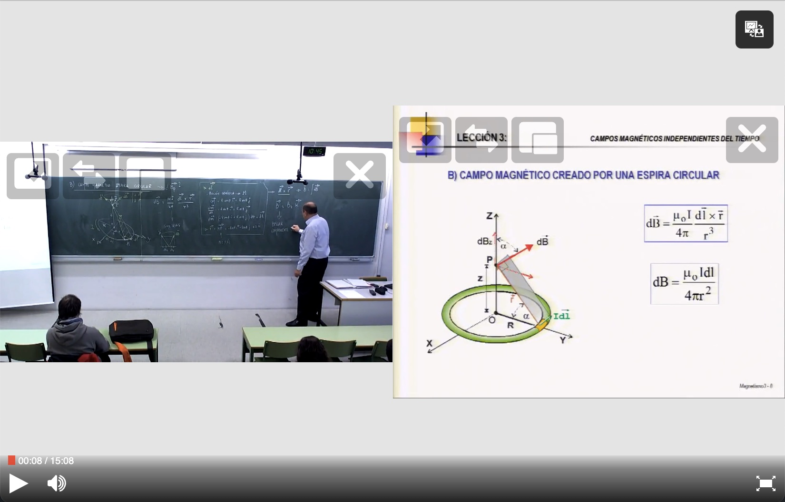

# Add plugins

## Installation

The main `paella-core` library contains only the most basic plugins to make the player work. To have a complete player, we need to complement it with the use of other plugins. In this example we are going to add a plugin library to add the most typical player buttons.

The first thing we do is install the `paella-basic-plugins` plugin library from `npm`:

```sh
$ npm install --save paella-basic-plugins
```

## Plugin context

To load a plugin we use a special load function that exports each plugin library. It is a function that returns an object called plugin context. This callback is called by `paella-core` at load time. Each plugin library must define a function that returns the plugin context. Using the `initData` object we will supply the callbacks to the player to load them when needed. Generally, the convention is that the plugin context function is obtained directly by importing the package from the plugin library.

```js
...
import getBasicPluginContext from 'paella-basic-plugins';

const initParams = {
    ...
    customPluginContext: [
        getBasicPluginContext(),
    ]
};
const player = new PaellaÇ('player-container', initParams);
...
```

With this we have imported the plugins library, but to make them work we need to activate them. We are going to activate two plugins: volume and fullscreen, in addition to the plugin we had activated before play/pause:

**settings.json:***

```js
{
    "plugins": {
        ...
         "es.upv.paella.playPauseButton": {
            "enabled": true,
            "order": 0
        },

        "es.upv.paella.volumeButtonPlugin": {
            "enabled": true,
            "side": "left",
            "order": 1
        },

        "es.upv.paella.fullscreenButton": {
            "enabled": true,
            "side": "right",
            "order": 3
        }
    }
}
```

In the configuration file we see one new attribute in the plugins configuration: `side`: Para los plugins de tipo botón, indica en qué lado se va a mostrar el botón, que puede ser a la izquierda o a la derecha.

As for the `order` attribute, we have already seen it in previous chapters. In general, this attribute indicates the loading order for a particular plugin type. But in the particular case of button plugins, they will be used to specify the position of one button relative to another. The lower the value of `order`, the sooner the button will load. 

Buttons on the left are set by default using the `float:left` CSS property, while those on the right are set with `float:right`. In this way, icons on the left are added from left to right, while those on the right are added from right to left. Knowing this, it is possible to use the `order` property to decide in which order the buttons are placed.

## Video layout selector

The video layout selector plugin allows you to switch between the available video layouts. In the [two streams](two_streams.md) tutorial we left one attribute to be configured in the layouts: the icon for a specific contentId. This icon will be used by the video layout selector, and we have to configure it before we can use it. The goal is to add an icon to each contentId. In addition to the icon, we already have an identifying text for each contentId, if we don't want to use the icons we can just use the `showIcons: false` attribute:

```json
{
    "plugins": {
        ...
        "es.upv.paella.layoutSelector": {
            "enabled": true,
            "side": "right",
            "order": 2,
            "showIcons": false
        },
    }
}
```

Para usar los iconos en los selectores de layout de vídeo, hay que proporcionar las imágenes. Se colocarán en el mismo directorio que la configuración. Las rutas de las imaágenes se cargarán en base a ese directorio. Crea cuatro ficheros en el directorio `settings` con los siguientes nombres:

**presenter-presentation.svg:**

```xml
<?xml version="1.0" encoding="UTF-8" standalone="no"?>
<!DOCTYPE svg PUBLIC "-//W3C//DTD SVG 1.1//EN" "http://www.w3.org/Graphics/SVG/1.1/DTD/svg11.dtd">
<svg width="100%" height="100%" viewBox="0 0 74 34" version="1.1" xmlns="http://www.w3.org/2000/svg" xmlns:xlink="http://www.w3.org/1999/xlink" xml:space="preserve" xmlns:serif="http://www.serif.com/" style="fill-rule:evenodd;clip-rule:evenodd;stroke-linejoin:round;stroke-miterlimit:1.41421;">
    <path d="M36,34L0,34L0,0L36,0L36,34ZM74,34L38,34L38,0L74,0L74,34ZM20,22L24.998,30.289C25.21,30.807 25.325,31.582 24.923,31.74C24.361,31.961 23.869,31.935 23.639,31.566L18.598,23.508L13.441,31.566C12.869,32.144 12.275,32.057 12.039,31.861C11.805,31.667 11.623,31.16 12.081,30.289L17,22L5,22L5,5L3,5L3,3L33,3L33,5L31,5L31,22L20,22ZM64.968,17L47.032,17C46.557,17 46.172,17.385 46.172,17.86L46.172,19.14C46.172,19.615 46.557,20 47.032,20L52,20L52,31L60,31L60,20L64.968,20C65.442,20 65.828,19.615 65.828,19.14L65.828,17.86C65.828,17.385 65.443,17 64.968,17ZM7,5L29,5L29,20L7,20L7,5ZM15.459,10.085L9.145,17.338L8.52,16.818L15.435,8.876L19.923,13.35L26.11,7.301L26.69,7.869L19.921,14.484L15.459,10.085ZM62.991,16C62.99,15.984 62.552,11.315 61.936,10.039C61.319,8.762 58.25,8.717 58.25,8.717C58.25,8.717 57.543,12.025 57.354,12.654C57.164,13.284 57.125,13.43 57.125,13.43C57.125,13.43 56.646,10.234 56.562,9.91C56.5,9.666 56.088,9.65 56,9.65C55.912,9.65 55.5,9.678 55.437,9.921C55.354,10.246 55.01,13.359 55.01,13.359C55.01,13.359 54.905,13.284 54.716,12.654C54.526,12.025 53.75,8.717 53.75,8.717C53.75,8.717 50.681,8.762 50.064,10.039C49.447,11.317 49.009,16 49.009,16L62.991,16ZM57.125,8.717C57.186,8.978 56.358,9.54 56.358,9.54L55.696,9.524C55.696,9.524 54.814,8.978 54.875,8.717C54.931,8.477 55.686,8.503 56,8.5C56.316,8.503 57.069,8.477 57.125,8.717ZM56,1.133C57.711,1.133 59.1,2.638 59.1,4.491C59.1,6.344 57.711,7.848 56,7.848C54.289,7.848 52.9,6.344 52.9,4.491C52.9,2.638 54.289,1.133 56,1.133Z"/>
</svg>
```

**presenter.svg:**

```xml
<?xml version="1.0" encoding="UTF-8" standalone="no"?>
<!DOCTYPE svg PUBLIC "-//W3C//DTD SVG 1.1//EN" "http://www.w3.org/Graphics/SVG/1.1/DTD/svg11.dtd">
<svg width="100%" height="100%" viewBox="0 0 36 34" version="1.1" xmlns="http://www.w3.org/2000/svg" xmlns:xlink="http://www.w3.org/1999/xlink" xml:space="preserve" xmlns:serif="http://www.serif.com/" style="fill-rule:evenodd;clip-rule:evenodd;stroke-linejoin:round;stroke-miterlimit:1.41421;">
    <path d="M36,0L36,34L0,34L0,0L36,0ZM26.968,20C27.442,20 27.828,19.615 27.828,19.14L27.828,17.86C27.828,17.385 27.442,17 26.968,17L9.032,17C8.558,17 8.172,17.385 8.172,17.86L8.172,19.14C8.172,19.615 8.558,20 9.032,20L14,20L14,31L22,31L22,20L26.968,20ZM24.991,16C24.99,15.984 24.552,11.315 23.936,10.039C23.319,8.762 20.25,8.717 20.25,8.717C20.25,8.717 19.543,12.025 19.354,12.654C19.164,13.284 19.125,13.43 19.125,13.43C19.125,13.43 18.646,10.234 18.562,9.91C18.5,9.666 18.088,9.65 18,9.65C17.912,9.65 17.5,9.678 17.437,9.921C17.354,10.246 17.01,13.359 17.01,13.359C17.01,13.359 16.905,13.284 16.716,12.654C16.526,12.025 15.75,8.717 15.75,8.717C15.75,8.717 12.681,8.762 12.064,10.039C11.447,11.317 11.009,16 11.009,16L24.991,16ZM19.125,8.717C19.186,8.978 18.358,9.54 18.358,9.54L17.696,9.524C17.696,9.524 16.814,8.978 16.875,8.717C16.931,8.477 17.686,8.503 18,8.5C18.316,8.503 19.069,8.477 19.125,8.717ZM18,1.133C19.711,1.133 21.1,2.638 21.1,4.491C21.1,6.344 19.711,7.848 18,7.848C16.289,7.848 14.9,6.344 14.9,4.491C14.9,2.638 16.289,1.133 18,1.133Z"/>
</svg>
```

**presentation.svg:**

```xml
<?xml version="1.0" encoding="UTF-8" standalone="no"?>
<!DOCTYPE svg PUBLIC "-//W3C//DTD SVG 1.1//EN" "http://www.w3.org/Graphics/SVG/1.1/DTD/svg11.dtd">
<svg width="100%" height="100%" viewBox="0 0 36 34" version="1.1" xmlns="http://www.w3.org/2000/svg" xmlns:xlink="http://www.w3.org/1999/xlink" xml:space="preserve" xmlns:serif="http://www.serif.com/" style="fill-rule:evenodd;clip-rule:evenodd;stroke-linejoin:round;stroke-miterlimit:1.41421;">
    <path d="M36,34L0,34L0,0L36,0L36,34ZM20,22L24.998,30.289C25.21,30.807 25.325,31.582 24.923,31.74C24.361,31.961 23.869,31.935 23.639,31.566L18.598,23.508L13.441,31.566C12.869,32.144 12.275,32.057 12.039,31.861C11.805,31.667 11.623,31.16 12.081,30.289L17,22L5,22L5,5L3,5L3,3L33,3L33,5L31,5L31,22L20,22ZM7,5L29,5L29,20L7,20L7,5ZM15.459,10.085L9.145,17.338L8.52,16.818L15.435,8.876L19.923,13.35L26.11,7.301L26.69,7.869L19.921,14.484L15.459,10.085Z"/>
</svg>

```

**pip.svg:**

```xml
<?xml version="1.0" encoding="UTF-8" standalone="no"?>
<!DOCTYPE svg PUBLIC "-//W3C//DTD SVG 1.1//EN" "http://www.w3.org/Graphics/SVG/1.1/DTD/svg11.dtd">
<svg width="100%" height="100%" viewBox="0 0 74 34" version="1.1" xmlns="http://www.w3.org/2000/svg" xmlns:xlink="http://www.w3.org/1999/xlink" xml:space="preserve" xmlns:serif="http://www.serif.com/" style="fill-rule:evenodd;clip-rule:evenodd;stroke-linejoin:round;stroke-miterlimit:2;">
    <g transform="matrix(1,0,0,1,-21.1235,0)">
        <path d="M78.894,34L31.475,34L31.475,0L78.894,0L78.894,7.324L68.428,7.324L68.428,32.323L78.894,32.323L78.894,34ZM64.968,17L47.032,17C46.557,17 46.172,17.385 46.172,17.86L46.172,19.14C46.172,19.615 46.557,20 47.032,20L52,20L52,31L60,31L60,20L64.968,20C65.442,20 65.828,19.615 65.828,19.14L65.828,17.86C65.828,17.385 65.443,17 64.968,17ZM62.991,16C62.99,15.984 62.552,11.315 61.936,10.039C61.319,8.762 58.25,8.717 58.25,8.717C58.25,8.717 57.543,12.025 57.354,12.654C57.164,13.284 57.125,13.43 57.125,13.43C57.125,13.43 56.646,10.234 56.562,9.91C56.5,9.666 56.088,9.65 56,9.65C55.912,9.65 55.5,9.678 55.437,9.921C55.354,10.246 55.01,13.359 55.01,13.359C55.01,13.359 54.905,13.284 54.716,12.654C54.526,12.025 53.75,8.717 53.75,8.717C53.75,8.717 50.681,8.762 50.064,10.039C49.447,11.317 49.009,16 49.009,16L62.991,16ZM57.125,8.717C57.186,8.978 56.358,9.54 56.358,9.54L55.696,9.524C55.696,9.524 54.814,8.978 54.875,8.717C54.931,8.477 55.686,8.503 56,8.5C56.316,8.503 57.069,8.477 57.125,8.717ZM56,1.133C57.711,1.133 59.1,2.638 59.1,4.491C59.1,6.344 57.711,7.848 56,7.848C54.289,7.848 52.9,6.344 52.9,4.491C52.9,2.638 54.289,1.133 56,1.133Z"/>
    </g>
    <g transform="matrix(0.64268,0,0,0.64268,49.1854,8.82915)">
        <path d="M36,34L0,34L0,0L36,0L36,34ZM20,22L24.998,30.289C25.21,30.807 25.325,31.582 24.923,31.74C24.361,31.961 23.869,31.935 23.639,31.566L18.598,23.508L13.441,31.566C12.869,32.144 12.275,32.057 12.039,31.861C11.805,31.667 11.623,31.16 12.081,30.289L17,22L5,22L5,5L3,5L3,3L33,3L33,5L31,5L31,22L20,22ZM7,5L29,5L29,20L7,20L7,5ZM15.459,10.085L9.145,17.338L8.52,16.818L15.435,8.876L19.923,13.35L26.11,7.301L26.69,7.869L19.921,14.484L15.459,10.085Z"/>
    </g>
</svg>
```

Now we associate the icons to each content id in the configuration:

```json
"es.upv.paella.dualVideoDynamic": {
    ...
    "validContent": [
        { "id": "presenter-presentation", "content": ["presenter","presentation"], "icon": "presenter-presentation.svg", "title": "Presenter and presentation" }
    ],
    ...
},

"es.upv.paella.singleVideoDynamic": {
    ...
    "validContent": [
        { "id": "presenter", "content": ["presenter"], "icon": "presenter.svg", "title": "Presenter" },
        { "id": "presentation", "content": ["presentation"], "icon": "presentation.svg", "title": "Presentation" }
    ],
    ...
},

"es.upv.paella.dualVideoPiP": {
    ...
    "validContent": [
        { "id": "presenter-presentation-pip", "content": ["presenter","presentation"], "icon": "pip.svg", "title": "PiP mode" }
    ],
    ...
},
```

Finally, we configure the video layout selector plugin to display icons:

```json
...
"es.upv.paella.layoutSelector": {
    "enabled": true,
    "side": "right",
    "order": 2,
    "showIcons": true
},
```

## Botones en contenedor de vídeo

Button plugins can be placed in the playback bar, but we can also place them in the video container. These buttons can also be placed left or right aligned. To place a button in the video container area, you can use the `parentContainer` property with the value `videoContainer`. If you want to put the button in the playback bar, use the value `playbackBar`, or remove the `parentContainer` property, as its default value is `playbackBar`

```json
...
"es.upv.paella.layoutSelector": {
    "enabled": true,
    "side": "right",
    "order": 2,
    "showIcons": true,
    "parentContainer": "videoContainer"
},
```

Note, however, that video layouts can also contain icons, and may overlap with buttons if placed in this way.



