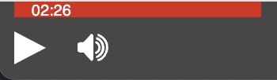
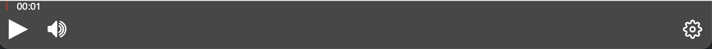
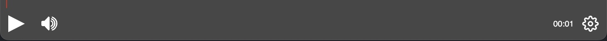
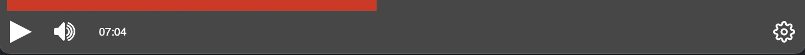

# Customize playback bar

The playback bar is customisable in two ways:

- Using CSS: to modify simple properties, such as colours or sizes.
- Using the configuration file: there are modifications that would be too complex to make with CSS alone, so there are options to modify the playbar more directly by modifying properties in the settings.


## Progress Indicator

The progress indicator is the bar that shows the percentage of playback of the video and also the current instant of playback. Using the `progressIndicator` property we can modify its appearance and some behaviours.

```json
{
    "progressIndicator": {
        // Progress indicator customization options
    }
}
```

### showTotal (boolean, default=true)

Shows or hides the total duration of the video.


### parentContainer (string, default="progressIndicator")

Indicates in which container the time indicator is to be placed. It can be placed inside the progress indicator itself or next to it in the button area. The possible values for this property are as follows:

**"buttonArea":**


**"progressIndicator":**



### side (string, default="left")

Indicates the side (left or right) where the remaining time indicator will be placed:

**"left":**



**"right":**




### Visible (boolean, default=true)

It is possible to hide the remaining time indicator completely. This can be done to show progress with other methods, for example by using a plugin.

### Show handler (boolean, default=false)

Displays a handle to seek the video. This handle is purely aesthetic: the playback bar will work the same with or without it.


### hideHandlerOnMouseOut (boolean, default=false)

Indicates if we want to hide the handle when the mouse is outside the playback bar.


### showRemainingProgress (boolean, default=false)

Displays a bar in the part of the video that has not yet been played.

**true:**


**false:**



### inlineMode (boolean, default=false)

Allows you to place the playback bar in the middle of the button bar (between the left-aligned and right-aligned buttons). This mode is recommended only when we are not going to activate many button plugins. It takes up a lot of space in the button area, but also makes it easier to use the progress bar to seek the video.

If this mode is enabled, it is recommended to leave the `parentContainer="progressIndicator"` property to save space:

```json
{
    "parentContainer": "buttonArea",
    "inlineMode": true,
    "showRemainingProgress": true
}
```


```json
{
    "parentContainer": "progressIndicator",
    "inlineMode": true,
    "showRemainingProgress": true
}
```


## Styling progress bar

There are a number of CSS variables that can be used to customise the playbar:

- `--button-fixed-width`, `--button-fixed-height`: width and height of the buttons.
- `--button-fixed-width-sm`, `--button-fixed-height-sm`: width and height of the buttons in small size mode.
- `--button-icon-size`: button icon size. By default, this size is calculated as `--button-fixed-width / 2`
- `--button-icon-size-sm`: button icon size, in small size mode. By default, this size is calculated as `--button-fixed-width-sm / 2`
- `--progress-indicator-height`: height of the playback bar
- `--playback-bar-height`: minimum height of the playback bar (the height can be changed by plugins, so it is defined as minimum height). By default is calculated as `--button-fixed-height + --progress-indicator-height`
- `--progress-indicator-handler-size`: size of the playback bar seek handle.
- `--playback-bar-width`: width of the player bar. The default is 100% of the player. If this value is changed to a lower value, the playback bar will be centred automatically.

The playbar works in two sizes: the small size is when the playbar is less than 700px wide, and the normal size is at larger sizes. This is related to the variables `--button-fixed-width`, `--button-fixed-height`, `--button-fixed-width-sm`, `--button-fixed-height-sm`, `--button-icon-size` and `--button-icon-size-sm`.

By default, the sizes defined for normal mode and small mode are the same. If the player is going to contain a lot of active plugins, it is advisable to modify the size in small mode to make them fit better. To do this, you only need to modify the `--button-fixed-width-sm` and `--button-fixed-height-sm` variables, as the rest of the variables are calculated automatically. The rest of the variables can be modified, but it is not essential.

We can also optimise the playbar buttons by hiding some buttons below a certain size. To do this we can use the `minContainerSize` property, which will cause that button not to be displayed if the playbar is smaller than that size. With this option we can hide the less relevant plugins when the player is too small to display them all. This property only works if the container where the button is located is the playback bar.

```json
"es.upv.paella.layoutSelector": {
    ...
    "parentContainer": "playbackBar",
    "minContainerSize": 600
},
```

## 