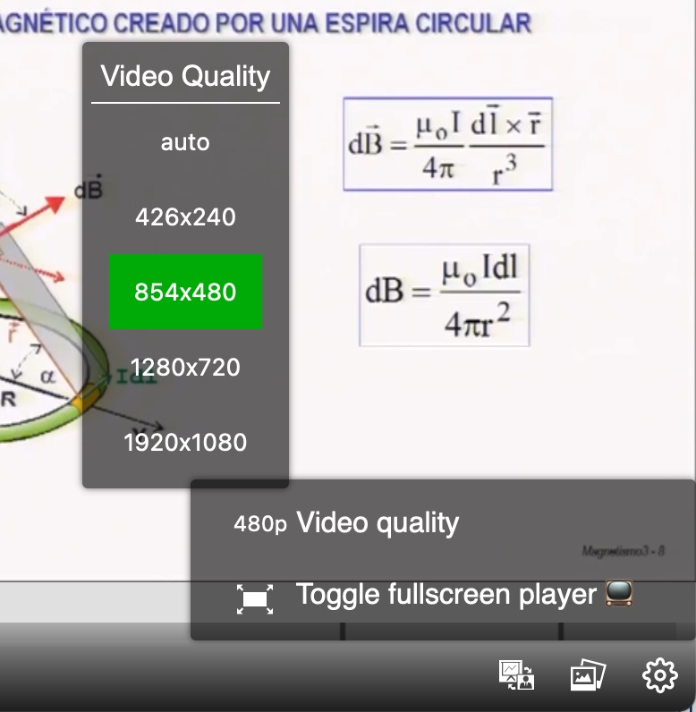

# Quality selector

In the previous tutorial we have learned how to use different video formats, some of which (HLS, HLS Live and images) support various resolution levels. To change the resolution level we need to use the image quality selection plugin.

The necessary plugin is already installed, because it belongs to the `paella-basic-plugins` package, so we only need to activate it:

```json
{
    ...
    "plugins": {
        ...
        "es.upv.paella.qualitySelector": {
            "enabled": true,
            "side": "right",
            "order": "2",
            "showIcon": false,
            "menuTitle": "Video Quality",
            "parentContainer": "options"
        }
    }
}   
```

We already know most of the configuration options we have added: `side`, `order`, `parentContainer` and `menuTitle` are explained in the [plugin tutorial](add_plugins.md).

The `showIcon` option is specific to this plugin, and indicates whether we want to show an icon on the button that displays the video quality options. If `true`, then a white box icon containing the text of the selected resolution is displayed. If the video quality labels are somewhat long, it is preferable to leave the option to `false`, which will make the width of the button fit the size of the text it contains.

To test the new icon, you can use the HLS stream example we added in the [previous tutorial](video_formats.md):

`http://localhost:5173/?id=hls-dual`

As we have configured the button, we will have the video quality selector available in the `options` button group.




Previous tutorial: [Video manifest: formats](video_formats.md)
Next tutorial: [Customize icons](customize_icons.md)

