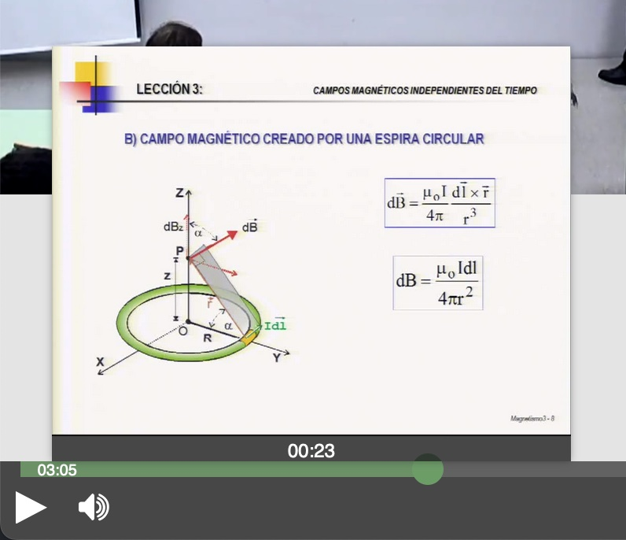
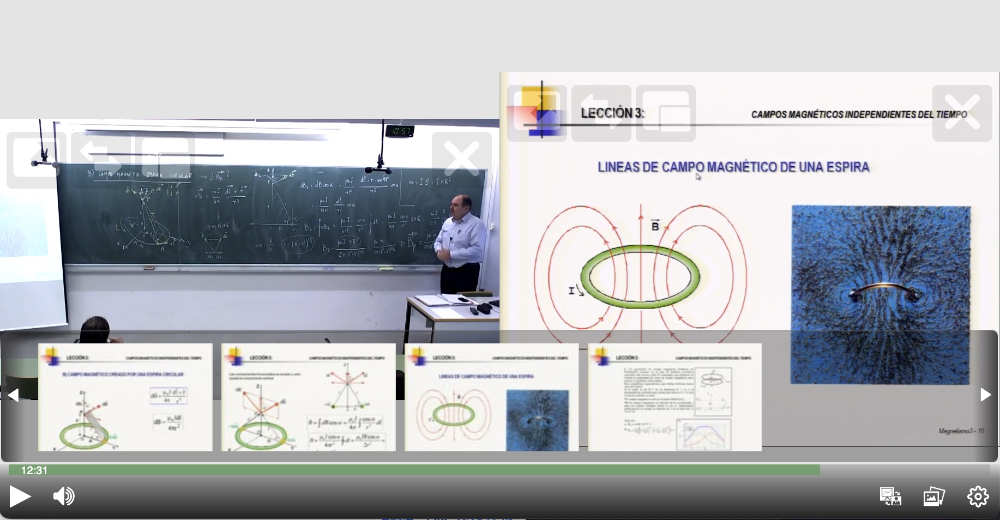
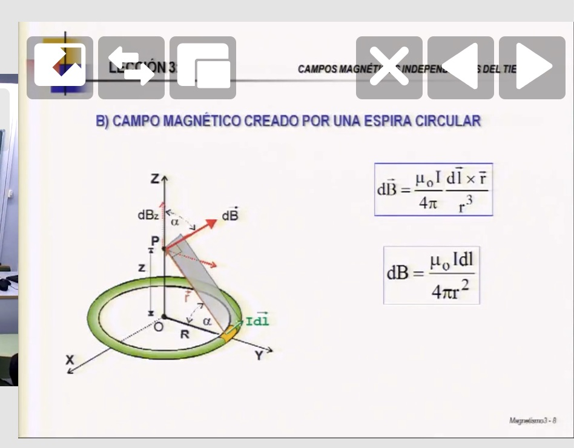
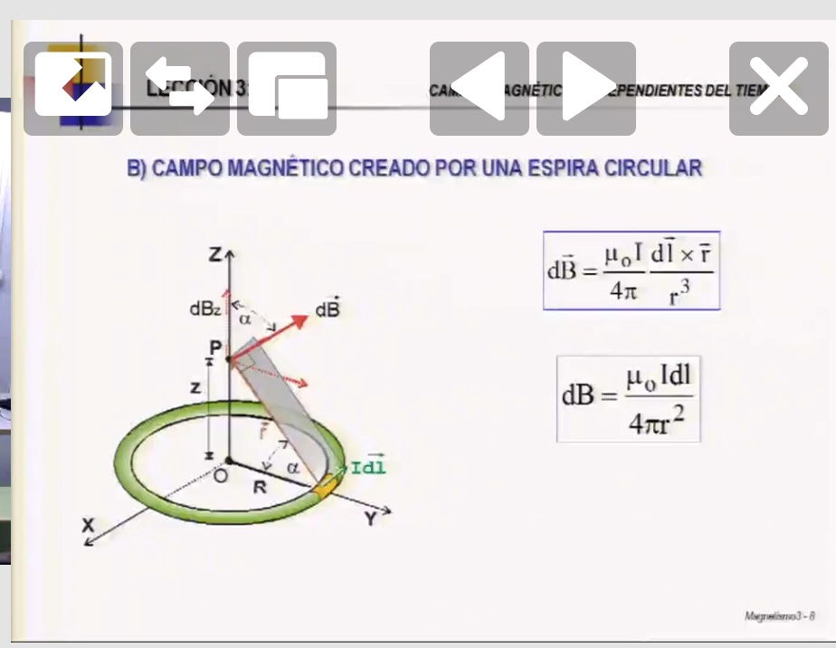
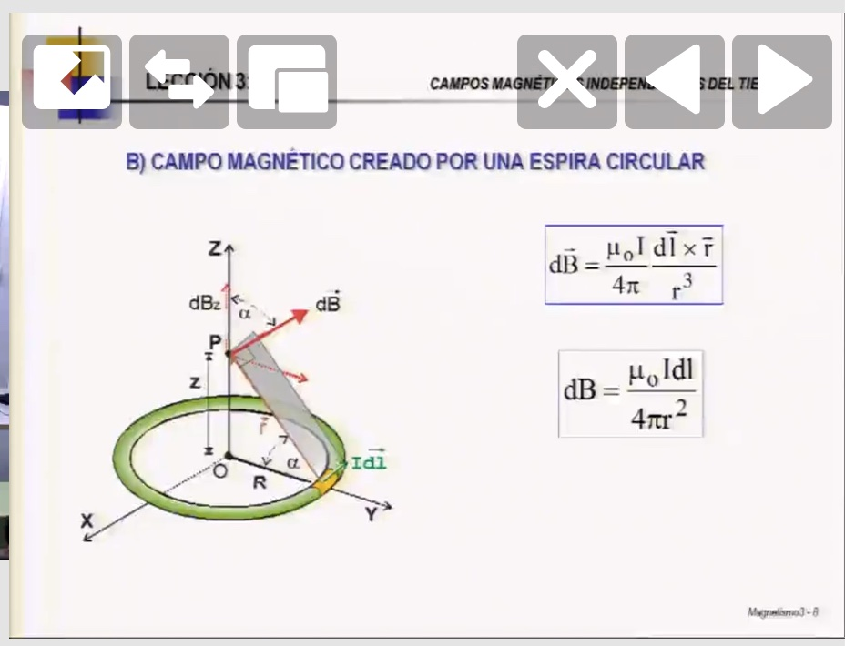

# Video frame thumbnails preview

The [video manifest](../video_manifest.md) file supports video thumbnails, which `paella-core` can use to preview them on the timeline. Besides that there are plugins that allow you to use those thumbnails for more things. In this tutorial we are going to learn how to do all this.

## Video manifest

The `frameList` attribute of the video manifest is an array that allows us to define preview images for each frame we want. Each element of the array is an object containing the following attributes:

```json
{
    ...
    "frameList": [
        {
            "id": "frame_000",
            "mimetype": "image/jpeg",
            "time": 0,
            "url": "image_url.jpg",
            "thumb": "thumb_url.jpg"
        },
        ...
    ]
}
```

- `id`: is the identifier of the frame. It can be any text string as long as it is unique.
- `mimetype`: is the mimetype of the image of the `url` attribute. The thumbnail image can be in any other format.
- `time`: is the time instant corresponding to the frame, expressed in seconds.
- `url`: is the URL of the frame image. This image must be at the highest resolution possible, as `paella-core` will only attempt to load it when it needs to be displayed at full size.
- `thumb`: is the URL of the thumbnail image.

Modify the `public/repo/dual-stream/data.json` file to add the thumbnail data:

```json
{
    ...
    "frameList": {
        "targetContent": "presentation",
        "frames": [
            {
                "id": "frame_854",
                "mimetype": "image/jpeg",
                "time": 854,
                "url": "https://repository.paellaplayer.upv.es/belmar-multiresolution/slides/3d90109c-9608-44c1-8660-fce3f216d716/presentation_cut.jpg",
                "thumb": "https://repository.paellaplayer.upv.es/belmar-multiresolution/slides/403de1df-aa66-44c0-b600-7683acf249b8/presentation_cut.jpg"
            },
            {
                "id": "frame_751",
                "mimetype": "image/jpeg",
                "time": 751,
                "url": "https://repository.paellaplayer.upv.es/belmar-multiresolution/slides/598bd2ba-4fef-4886-884e-0ab82176f13d/presentation_cut.jpg",
                "thumb": "https://repository.paellaplayer.upv.es/belmar-multiresolution/slides/73a6564c-b2d6-4896-b0f1-38129dde2c85/presentation_cut.jpg"
            },
            {
                "id": "frame_0",
                "mimetype": "image/jpeg",
                "time": 0,
                "url": "https://repository.paellaplayer.upv.es/belmar-multiresolution/slides/7dc22bee-14f3-442c-8f0d-30d8b68c8604/presentation_cut.jpg",
                "thumb": "https://repository.paellaplayer.upv.es/belmar-multiresolution/slides/46561b90-85b3-4ad7-a986-cdd9b52ae02b/presentation_cut.jpg"
            },
            {
                "id": "frame_363",
                "mimetype": "image/jpeg",
                "time": 363,
                "url": "https://repository.paellaplayer.upv.es/belmar-multiresolution/slides/d3194d9b-8f65-403b-a639-9de4311a283b/presentation_cut.jpg",
                "thumb": "https://repository.paellaplayer.upv.es/belmar-multiresolution/slides/4505b6d9-8a0c-4809-ade3-840e743188ed/presentation_cut.jpg"
            }
        ]
    }
}
```
NOTE: The frame preview settings have changed as of `paella-core` v1.40. Files from earlier versions are still supported, but the example above will only work with `paella-core` v1.40 or higher.

If a video manifest contains a list of frames, then `paella-core` will use it to represent them on the timeline when hovering the mouse cursor over them:



You can see more about [frame thumbnails in the documentation on video manifest](../video_manifest.md).

## Slide plugins

Install the `paella-slide-plugins` package in your player project:

```sh
$ npm install --save paella-slide-plugins
```

A continuación, añade el plugin context a `initParams`:

```js
...
import getSlidePluginContext from 'paella-slide-plugins';

const initParams = {
    ...
    customPluginContext: [
        ...
        getSlidePluginContext()
    ]
};
```

We are going to activate some plugins from the package we just added.


### frameControlButtonPlugin

It is a button type plugin, which when activated displays a scrollable view with the frame thumbnails of the video. Hovering the mouse over the thumbnails displays the corresponding image in full resolution (indicated by the `url` attribute within each frame in the video manifest). Clicking on the thumbnail seeks the video to the instant of time at which that frame appears.

In the configuration file, add the following settings:

```json
{
    ...
    "plugins": {
        ...
        "es.upv.paella.frameControlButtonPlugin": {
            "enabled": true,
            "side": "right",
            "order": 2,
            "targetContent": "presentation"
        }
    }
}
```

There is a new attribute in the configuration of this plugin: `targentContent`. It corresponds to the `content` attribute of each stream in the video manifest. When the image of the frame is displayed in full resolution, it will be displayed over the container of the video stream that corresponds to `targetContent`. As in the video we have included the presentation frames, we define `targetContent` as `presentation`.

In the frame list in the video manifest it is possible to specify the `targetContent`. If so, the value defined in the video manifest will take precedence over the plugin settings.



## slideMapProgressBarPlugin

This plug-in adds marks on the playback bar in the areas where there is a preview image.

```json
{
    ...
    "plugins": {
        ...
        "es.upv.paella.slideMapProgressBarPlugin": {
            "enabled": true,
            "markColor": {
                "mouseOut": "#0A0A0A",
                "mouseHover": "#A9A9A9"
            },
            "markWidth": 3,
            "drawBackground": true
        }
    }
}
```


- `markColor`: specify the color of the mark in two cases: when the mouse is over the time line and when the mouse is out of it.
- `markWidth`: set the width of the mark, in pixels.
- `drawBackground`: In general, plugins of type `ProgressBarPlugin` allow to draw content in the progress bar. This content can be drawn in the background layer or in the foreground layer. The background layer is behind the current time bar, while the foreground layer is above it. If this parameter is `true`, the markers will be drawn behind the elapsed time bar:

**`drawBackground: true`:**


**`drawBackground: false`:**


### nextSlideNavigatorButton and prevSlideNavigatorButton

These are two plugins that are used to move to the previous slide and to the next one. They are plugins of type `CanvasButtonPlugin`, which are placed in one of the video canvas. These buttons are added in the video canvas and the position indicated in the configuration.

```json
{
    ...
    "plugins": {
        ...
        "es.upv.paella.nextSlideNavigatorButton": {
            "enabled": true,
            "content": [
                "presentation"
            ],
            "side": "right",
            "order": 0
        },

        "es.upv.paella.prevSlideNavigatorButton": {
            "enabled": true,
            "content": [
                "presentation"
            ],
            "side": "right",
            "order": 1
        }
    }
}
```



- `content`: is an array where we indicate the content of the video stream where we want to add the buttons. You can add more than one `content` if you want the buttons to appear in more than one stream.
- `side`: indicates the side of the container where we want to add the buttons. When modifying this attribute, we may also need to change the `order` attribute. Notice how depending on the value of `side`, it may be necessary to modify the order in which each plugin is loaded:


```json
"es.upv.paella.nextSlideNavigatorButton": {
    ...
    "side": "center",
    "order": 1
},

"es.upv.paella.prevSlideNavigatorButton": {
    ...
    "side": "center",
    "order": 0
}
```



```json
"es.upv.paella.nextSlideNavigatorButton": {
    ...
    "side": "right",
    "order": 0
},

"es.upv.paella.prevSlideNavigatorButton": {
    ...
    "side": "right",
    "order": 1
}
```



If the `order` attribute of the plugins is not properly configured, the arrows will appear inverted:

```json
"es.upv.paella.nextSlideNavigatorButton": {
    ...
    "side": "right",
    "order": 1
},

"es.upv.paella.prevSlideNavigatorButton": {
    ...
    "side": "right",
    "order": 0
}
```


Previous tutorial: [Customize playback bar](customize_playback_bar.md)
Next tutorial: [Video manifest: formats](video_formats.md)
